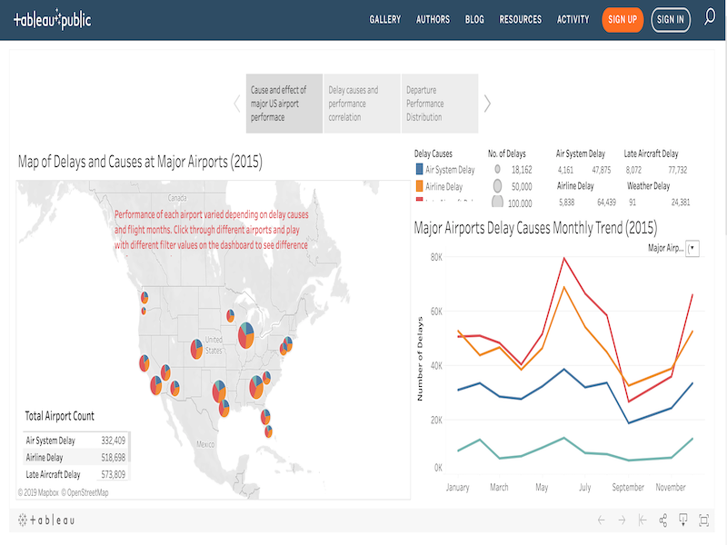
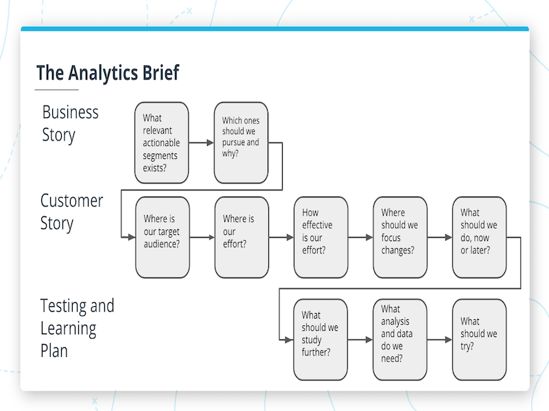

# Marketing Analytics Nanodegree (MAND), Udacity
This repo contains a collection of project deliverables from my MAND course work.
 ---

## Project Deliverables Summary
### 1. [Interpret a Data Visualization](https://github.com/atan4583/mand-project-portfolio/tree/master/Project%201-Interpret%20a%20Data%20Visualization)
> * Analyze the Tableau dashboard [Madrid in Detail](https://public.tableau.com/en-us/s/gallery/madrid-details?gallery=featured) and find 3 insights in the dashboard.
>
>
> * For each insight, provide a static image to share the finding. Write a short report to explain each observation and how the conclusion was reached using the information from the dashboard.
>
>
> * Tool: Tableau Dashboard
>
>
> * Artifact: Project 1-Interpret a Data Visualization.pdf
>
>
> ### [Project Assessment](https://github.com/atan4583/mand-project-portfolio/blob/master/Project%201-Interpret%20a%20Data%20Visualization/Project%201%20Review.pdf)
 ---
### 2. [Analyze Survey Data](https://github.com/atan4583/mand-project-portfolio/tree/master/Project%202-Analyze%20Survey%20Data)
> * Analyze a [survey data](https://d17h27t6h515a5.cloudfront.net/topher/2017/December/5a30463e_surveydata3/surveydata3.csv) about current Udacity students across a number of programs, go through the process of calculating summary statistics and building visual methods of spreadsheet data to find interesting information out about Udacity students.
>
>
> * Produce a presentation report from the analysis along with visualizations to explain the findings and support the conclusions drawn.
>
>
> * Tool: Microsoft Excel (version Office 365 2019 for Windows or later)
>
>
> * Artifact: Project 2-Analyze Survey Data.pdf, surveydata_Proj2wkbk.xlsx
>
>
> ### [Project Assessment](https://github.com/atan4583/mand-project-portfolio/blob/master/Project%202-Analyze%20Survey%20Data/Project%202%20Review.pdf)
 ---
### 3. [Storytelling With Data](https://github.com/atan4583/mand-project-portfolio/tree/master/Project%203-Storytelling%20With%20Data)
> * Analyze the historical transactions (dated between 01/12/2010 and 09/12/2011) in the [Ecommerce Data Set](https://docs.google.com/spreadsheets/d/12EPcAufhey6m0AmQ1nB4f5X1MaDdm81GAeKvCV16Dis/edit?usp=sharing) of a UK-based online wholesaler of unique all-occasion gifts, come up with a question to explore and create a visual story to answer the question.
>
>
> * Produce a report on the visual story complete with analysis to support the conclusions drawn.
>
>
> * Tool: Microsoft Excel
>
>
> * Artifact: Project 3-Storytelling with Data.pdf, EcommDataClean.xlsx
>
>
> ### [Project Assessment](https://github.com/atan4583/mand-project-portfolio/blob/master/Project%203-Storytelling%20With%20Data/Project%203%20Review.pdf)
 ---
 ---
### 4. [Data Visualization Project](https://github.com/atan4583/mand-project-portfolio/tree/master/Project%204-Data%20Visualization%20Project)
> * Analyze the [Flight Delays dataset](https://d17h27t6h515a5.cloudfront.net/topher/2017/December/5a3b1fad_flight-delays/flight-delays.zip) containing the on-time performance of US domestic flights operated by large air carriers in 2015, build 3 visualizations to tell a story or highlight patterns in the data set.
>
>
> * Host the visual story board on Tableau Public and produce a report to communicate the insights drawn from the story board, along with links to the Tableau dashboards or story.
>
>
> * Tool: Tableau Public, Tableau Desktop
>
>
> * Artifact: Project 4-Build Data Dashboards.pdf, project4-Build Data Dashboards.twbx
>
>
> Click [here](https://public.tableau.com/profile/audreyst#!/vizhome/project4-BuildDataDashboards/MajorAirportPerformance2015) to see the interactive _**Tableau Story board**_. Enjoy :sparkles: !!!
> 
>
> ### [Project Assessment](https://github.com/atan4583/mand-project-portfolio/blob/master/Project%204-Data%20Visualization%20Project/Project%204%20Review.pdf)
 ---
### 5. [Use Advanced Displays, Segments and Views](https://github.com/atan4583/mand-project-portfolio/tree/master/Project%205-Use%20Advanced%20Displays%2C%20Segments%20and%20Views)
> * Use readily available tools in Google Analytics to bridge the gap between raw data and actionable insight. Levarage best practices for working in Google Analytics to explore data and apply segmentation techniques to answer questions.
>
>
> * Create a report demonstrating how to create primary view, filter, answer analytics questions using segmentation technique and reports and in Audience, Acquisition, Behavior and Conversion areas in Google Analytics. The
>
>
> * Tool: Google Analytics
>
>
> * Artifact: Project 5-Advanced Displays Creating Segments and Applying View Settings and Filters.pdf
>
>
> ### [Project Assessment](https://github.com/atan4583/mand-project-portfolio/blob/master/Project%205-Use%20Advanced%20Displays%2C%20Segments%20and%20Views/Project%205%20Review.pdf)
 ---
### 6. [Navigating Reports Dashboards](https://github.com/atan4583/mand-project-portfolio/tree/master/Project%206-Navigating%20Reports%20Dashboards)
> * Build and design a dashboard for the Google Merchandise Store using Data Studios.
>
>
> * Create a report documenting how to build a dashboard for the Google Merchandise Store with Google Data Studio.
>
>
> * Tool: Google Data Studio
>
>
> * Artifact: Project 6-Navigating Reports and Dashboards.pdf
>
>
> ### [Project Assessment](https://github.com/atan4583/mand-project-portfolio/blob/master/Project%206-Navigating%20Reports%20Dashboards/Project%206%20Review.pdf)
 ---
### 7. [Crafting an Analytic Brief](https://github.com/atan4583/mand-project-portfolio/tree/master/Project%207-Crafting%20an%20Analytic%20Brief)
> * Craft an Analytics Brief to analyze performance of the marketing efforts of a given company.
> 
> Use the brief as a framework to identify the data to capture for measuring performance metrics. Attach a customer journey map to the brief and use it to further evaluate the metrics being captured and evaluate whether the customer journey has revealed any gaps in the brief itself. Provide suggestions for addressing those potential gaps.
>
>
> * Create a report illustrating how to create the analytics brief to unlock the questions needed to be asking and the corresponding thru the analytics process.
>
>
> * Tool: Analytic Brief template adapted from Cesar A Brea's approach
>
>
> * Artifact: Project 6-Project 7-Crafting an Analytic Brief.pdf
>
>
> ### [Project Assessment](https://github.com/atan4583/mand-project-portfolio/blob/master/Project%207-Crafting%20an%20Analytic%20Brief/Project%207%20Review.pdf)
>
